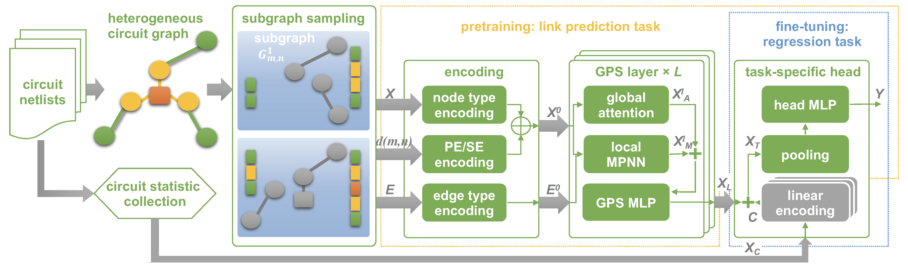

# CirGPS
## Few-shot Learning on AMS Circuits and Its Application to Parasitic Capacitance Prediction
Note: 
* This is a initail version of CirGPS for doulbe-blind review.
* The full datasets will be released as a individual work soon.


Graph representation learning is a powerful method to extract features from graph-structured data, such as analog/mixed-signal (AMS) circuits. However, training deep learning models for AMS designs is severely limited by the scarcity of integrated circuit design data. 
This is the repository of CirGPS, a few-shot learning method for parasitic effect prediction in AMS circuits.

The proposed method contains five steps: 
1. AMS netlist conversion, 
2. enclosing subgraph extraction, 
3. position encoding, 
4. model pre-training/fine-tuning. 

CirGPS is built on the top of [GraphGPS](https://github.com/rampasek/GraphGPS.git), which is
using [PyG](https://www.pyg.org/) and [GraphGym from PyG2](https://pytorch-geometric.readthedocs.io/en/2.0.0/notes/graphgym.html).
Specifically *PyG v2.2* is required.

## Instructions

### Python environment setup with Conda
These codes are tested on our platform with pytorch=1.13.1, cuda=11.7.

Firstly, you need to install Git Large File Storage [LFS](https://docs.github.com/en/repositories/working-with-files/managing-large-files/installing-git-large-file-storage).

Then, you can directly use our conda config file
``` bash
conda env create -f cirgps.yaml
```
or use the oringal environment of [GraphGPS](https://github.com/rampasek/GraphGPS.git).

### Running an experiment with CirGPS
In the 'configs/sram' floder, the files starting with 'sram-' are for the link-prediction task, those starting with 'reg-' are for the edge-regression task.

```bash
conda activate graphgps

# Running an arbitrary config file in the `configs` folder
python main.py --cfg configs/sram/<config_file>.yaml 
```
We provide the config files necessary to reproduce our experiments under `configs/` (see more below).

## Other Details
The major modifications of GraphGPS are in the folder [graphgps/loader](graphgps/loader), where we define a new type of dataset [SealSramDataset](graphgps/loader/dataset/sram_dataset.py).
Other supportive updates include default configs in the [config](graphgps/config) folder, 'DSPD' encoder in the [encoder](graphgps/encoder) folder, the task-specific head in the [head](graphgps/head) folder, and PE computation in the [transform](graphgps/transform) folder.